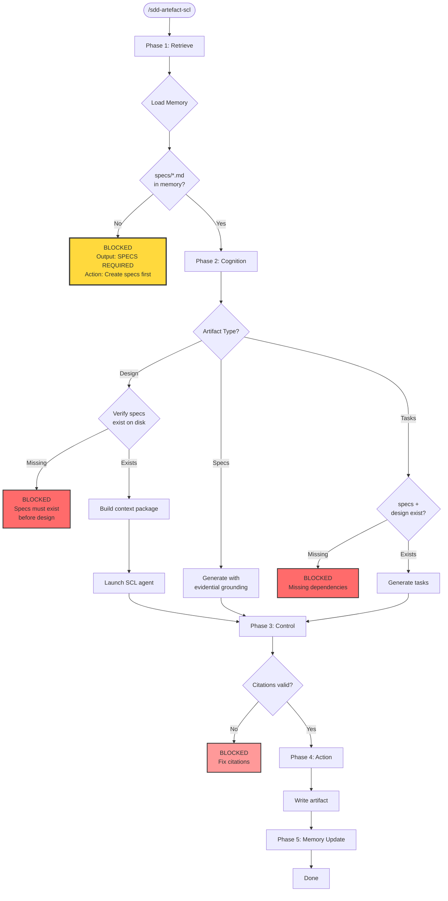

Create the next artifact using the Structured Cognitive Loop (SCL) approach.

**Usage:** `/sdd-artefact-scl`

## SCL-Enhanced Sequential Workflow



**Sequential Enforcement in SCL:**
- Design BLOCKED until specs exist (checked in memory + disk)
- Tasks BLOCKED until both specs AND design exist
- Verification checkpoint: All specs requirements must be covered in design

## Phase 1: Retrieve

1. **Detect current change** - Scan `.specs/changes/`, ask if multiple
2. **Check artifact status** - DONE, READY, BLOCKED
   - For design: BLOCKED if no specs/ directory exists
   - For tasks: BLOCKED if specs/ or design.md missing
3. **Load memory context**:
   - Read `.memory/decisions.json` for prior decisions
   - Read `.memory/requirements.json` for existing requirements
   - Read `.memory/control-log.json` for blocking issues
   - Read `regulation.md` for active rules
4. **Verify prerequisites on disk**:
   - For design: Verify `specs/**/*.md` exists (memory check alone insufficient)
   - If specs missing on disk: **BLOCKED** - Output "SPECS REQUIRED" message
5. **Read dependencies**:
   - For specs: proposal.md
   - For design: proposal.md, specs/**/*.md (REQUIRED)
   - For tasks: proposal.md, specs/**/*.md, design.md

## Phase 2: Cognition

### For Design Document Creation

**Prerequisite Check (BLOCKS if missing):**

Before gathering context, verify specs exist:
- Check `.memory/requirements.json` has entries
- Verify `specs/**/*.md` files exist on disk
- If either check fails: **BLOCKED**

**BLOCKED Output for Design:**
```
✗ BLOCKED: Cannot create design

REASON: No specifications found
MEMORY: requirements.json empty or missing
DISK: specs/ directory empty or missing

REQUIRED: specs/*.md MUST exist before design

ACTION REQUIRED:
  /sdd-artefact-scl  - Create specs first
  
Current State:
  Memory: No requirements harvested
  Disk: No spec files
  Design: BLOCKED
```

5. **Gather prior context from memory**:
   - Read `.memory/decisions.json` for all prior decisions
   - Read `.memory/requirements.json` for requirement priorities
   - Read `.memory/episodes.json` for Q&A history
   - Parse `proposal.md` for _Context Log section
   - Extract user preferences and constraints

6. **Build memory context package**:
   ```
   Memory Context:
   - Prior Decisions: [from decisions.json]
   - Requirements: [from requirements.json with status]
   - Q&A History: [from episodes.json]
   - User Preferences: [from proposal/specs]
   - Constraints: [technical/business/external]
   - Control State: [from control-log.json]
   ```

7. **Launch SCL design agent**:
    - **Agent:** `sdd-design-scl`
    - Inject memory context package
    - Agent follows SCL 6-phase workflow:
      - Phase 1: Retrieve (memory already loaded)
      - Phase 2: Cognition (generate with citations)
      - Phase 3: Control (validate citations, check rules)
      - Phase 4: Write & Review Loop (write draft, then 3 review iterations)
      - Phase 5: Finalization (update proposal status)
      - Phase 6: Memory Update (extract decisions)
    - **IMPORTANT:** Agent handles ALL phases including proposal status update. Skip command Phases 3-5 for design.
    - **Agent verifies:** All requirements from specs are addressed in design

### For Other Artifacts (specs, tasks)

These artifacts are handled by the command directly:

5. **Generate artifact** with evidential grounding:
   - Every requirement MUST cite source
   - Every decision MUST cite alternatives
   - Every task MUST cite evidence
6. **Show preview** before writing

## Phase 3: Control (specs, tasks only)

**NOTE:** For design, skip to output - the agent handles all phases.

7. **Validate citations** - All citations MUST resolve
8. **Check regulation compliance** - Block on violations
9. **Check consistency** - No contradictions with memory

## Phase 4: Action (specs, tasks only)

**NOTE:** For design, skip to output - the agent handles all phases.

10. **Write artifact** (if control approved)
11. **Update proposal status**

## Phase 5: Memory Update (specs, tasks only)

**NOTE:** For design, skip to output - the agent handles all phases.

12. **Extract decisions** → `.memory/decisions.json`
13. **Extract requirements** → `.memory/requirements.json`
14. **Record citations** → `.memory/citations.json`
15. **Log checkpoint** → `.memory/control-log.json`

**Output:**
```
✓ Retrieved: Memory context loaded
✓ Cognition: Generated specs/auth/spec.md with 5 requirements
✓ Control: All 12 citations verified, regulation compliant
✓ Action: Written to specs/auth/spec.md
✓ Memory: Updated decisions.json, requirements.json, citations.json

Artifact Status:
  proposal: DONE
  specs: DONE ← just completed
  design: READY (can create next)
  tasks: BLOCKED (waiting for design)

Memory State:
  decisions: 3
  requirements: 5
  citations: 12

Next: Use /sdd-artefact-scl to create design
```

**If BLOCKED on design (no specs):**
```
✗ BLOCKED: Cannot proceed to design

REASON: Prerequisites not met
  - Memory: requirements.json: empty
  - Disk: specs/: not found

REQUIRED: Create specifications first

ACTION:
  /sdd-artefact-scl  - Create specs now

Current Status:
  proposal: DONE
  specs: BLOCKED (not created)
  design: BLOCKED (needs specs)
  tasks: BLOCKED (needs specs + design)
```

**If control blocks:**
```
✗ Control: BLOCKED

Failed checks:
  - Citation "design.md#L999" does not exist
  - Regulation violation: Requirement AUTH-003 missing source

Required actions:
  1. Add valid citation for AUTH-003 source
  2. Remove or fix invalid citation

Memory state preserved. Re-run after fixes.
```

After creating, report status. Then output ONLY the relevant next step based on what was just completed:

**If specs were just created:**
```
---
Next: Use /sdd-artefact-scl to create design
---
```

**If design was just created:**
```
---
Next: Use /sdd-artefact-scl to create tasks
---
```

**If tasks were just created:**
```
---
Next Steps:
  /sdd-apply-group-scl N - Execute group N with memory context
  /sdd-apply-all-scl     - Execute all groups
---
```

DO NOT show options that don't apply to the current state.
DO NOT suggest commands not listed above.

---

## Valid Next Commands

**Sequential SCL Workflow - Enforced Order:**

**After creating proposal:**
- `/sdd-init-memory` - Initialize memory + harvest from proposal
- `/sdd-artefact-scl` - Create specs (REQUIRED before design)

**After creating specs:**
- `/sdd-artefact-scl` - Create design document with memory tracking
  - **Prerequisites verified:** specs/*.md exist
  - **If missing:** BLOCKED with "Create specs first" message

**If design requested without specs:**
```
⚠️  BLOCKED: Create specs first
   Reason: SCL requires specs in memory and on disk
   Action: /sdd-artefact-scl to create specs
```

**After creating design:**
- `/sdd-artefact-scl` - Create tasks document with memory tracking
  - **Prerequisites verified:** Both specs AND design exist

**If tasks requested without design:**
```
⚠️  BLOCKED: Create design first
   Reason: Tasks require design.md for technical approach
   Action: /sdd-artefact-scl to create design
```

**After creating tasks:**
- `/sdd-apply-group-scl N` - Execute group N with SCL memory context
- `/sdd-apply-all-scl` - Execute all groups with SCL memory context
- `/sdd-status` - Check current progress
- `/sdd-memory-status` - View memory state

**Do NOT use these as commands (they are skills/agents):**
- ❌ `/sdd-requirements` (skill, loaded by this command)
- ❌ `/sdd-design-scl` (agent, invoked by this command)
- ❌ `/sdd-tasks-scl` (skill, loaded by this command)
- ❌ `/sdd-memory` (skill, loaded by /sdd-init-memory)

**Loads skills:** `sdd-artefact-scl`, `sdd-requirements`, `sdd-memory`, `sdd-design`, `sdd-tasks-scl`
