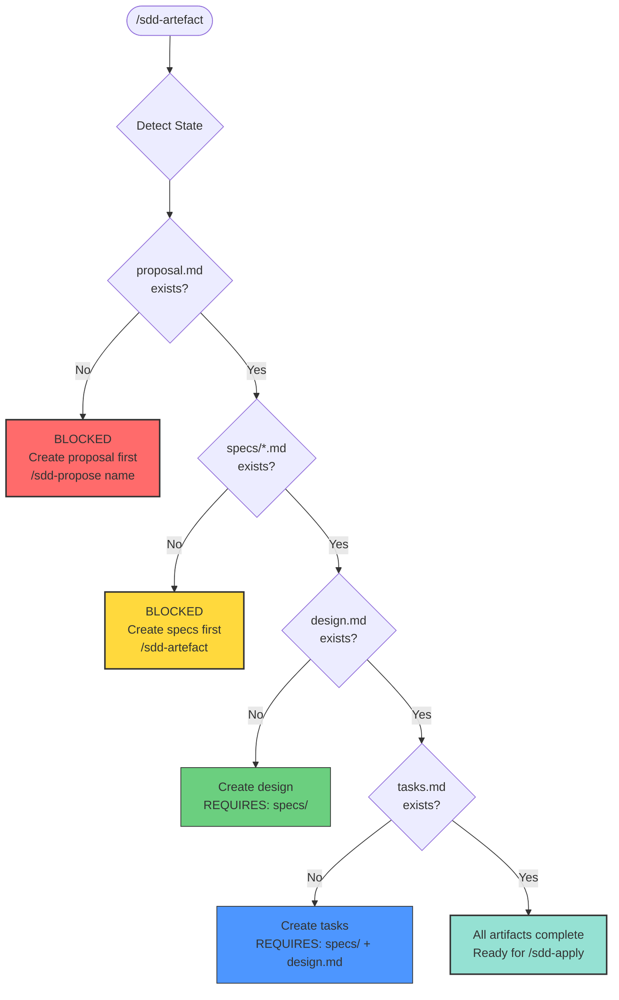

Create the next artifact in my current spec development process.

## Artifact Creation Workflow



**Strict Sequential Order:**
1. `proposal.md` (root)
2. `specs/*.md` (BLOCKED until proposal exists)
3. `design.md` (BLOCKED until specs exist)
4. `tasks.md` (BLOCKED until specs + design exist)

Follow the sdd-spec-artefact skill:

1. **Detect which change to continue** - Scan `.specs/changes/`, if multiple ask me to choose
2. **Check artifact status** - DONE, READY, BLOCKED (with BLOCKED messages)
3. **Enforce sequential order** - specs MUST exist before design can be created
   - If design requested but specs missing: Output **"BLOCKED: Create specs first (required)"**
   - Never skip or create out of order
4. **Select the next ready artifact** - specs → design → tasks (sequential only)
5. **Read dependencies** - Load context from completed artifacts
   - For design: specs/**/*.md is REQUIRED input
   - For specs modifying existing: Read `.specs/specs/<module>/<capability>/spec.md`
6. **Create ONE artifact** with proper structure
   - Verify dependencies exist before creating
   - For NEW capabilities: Use ADDED format
   - For MODIFIED capabilities: Use delta format (MODIFIED/ADDED/REMOVED)
7. **Update proposal status**
8. **Report what was created and what's next**

**BLOCKED Message Templates:**

```
⚠️  BLOCKED: Cannot create [artifact]

REASON: [dependency] does not exist
REQUIRED: [explanation]

ACTION REQUIRED:
  [correct command]

Current Status:
  proposal: [status]
  specs: [status]
  design: [status]
```

Show me:
- What artifact you're creating
- Why it's next (dependency status)
- A preview before writing
- Any BLOCKED states with clear next steps

---

## Design Document Creation (Orchestrated Review Loop)

**PREREQUISITE:** `specs/**/*.md` MUST exist before creating design.md

### Step 0: Verify Prerequisites (BLOCKS if missing)

Before gathering context, verify specs exist:
- Check `specs/` directory has ≥1 `.md` file
- If missing: **HALT** and output BLOCKED message
- If empty: **HALT** - specs must be created first

**BLOCKED Output:**
```
⚠️  BLOCKED: Cannot create design.md

REASON: No specs/*.md files found
REQUIRED: Specifications MUST exist before design
           (design agent requires specs as input)

ACTION REQUIRED:
  /sdd-artefact     - Create specs first (required)
  
Current Status:
  proposal: DONE
  specs: BLOCKED (missing)
  design: BLOCKED (needs specs)
```

### Step 1: Gather Prior Context

Before launching the design agent, collect context from earlier phases:

**From proposal.md:**
- Parse `_Context Log` section if present
- Extract Q&A responses and user preferences
- Note constraints mentioned during proposal creation
- Capture any remarks or decisions made

**From specs/**/*.md:**
- Extract requirements with IDs
- Note priority markers (critical/high/medium/low)
- Identify dependencies between requirements
- Mark design hints or implementation preferences

**From interactive session:**
- User clarifications from any Q&A
- Design preferences expressed
- Constraint refinements

### Step 2: Build Context Package

Compile the gathered context into a structured package:

```
Context Package:
- User Preferences: [list of preferences]
- Constraints: [technical/business/external]
- Prior Decisions: [decisions from proposal/specs]
- Priority Requirements: [critical/high items]
- Similar Features: [existing code to reference]
- Q&A Responses: [relevant answers]
```

### Step 3: Create Initial Design

**Agent:** `@sdd-design` (MODE=create)

Invoke the design agent with:
```
CHANGE_DIR=".specs/changes/<name>"
MODE="create"
```

The agent will:
1. Read proposal.md, specs/**/*.md from CHANGE_DIR
2. Analyze codebase (detect tech stack, patterns, conventions)
3. Generate design.md with all required sections
4. Write initial draft to `{CHANGE_DIR}/design.md`
5. Return completion summary

Wait for agent to complete before proceeding to Step 4.

### Step 4: Design Review Loop (5 iterations, MANDATORY)

**This loop is orchestrated HERE — the command alternates between analyst and designer.**

The loop **MUST** complete all 5 iterations. Even if early iterations return APPROVE, continue through iteration 5.

**FOR iteration = 1 to 5:**

#### Step 4a: Invoke Design Analyst

**Agent:** `@sdd-design-analyst`

Invoke with:
```
CHANGE_DIR=".specs/changes/<name>"
ITERATION={iteration}
```

The analyst will:
1. Read design.md from CHANGE_DIR
2. Read specs/**/*.md, proposal.md from CHANGE_DIR
3. Read review-iteration-{iteration-1}.md (if iteration > 1) from CHANGE_DIR
4. Perform systematic analysis
5. Write critique to `{CHANGE_DIR}/review-iteration-{iteration}.md`
6. Return verdict (REVISE/CONDITIONAL/APPROVE) and issue counts

Wait for analyst to complete.

#### Step 4a-verify: Confirm Design Review File Exists

After the analyst returns, **you MUST verify** the review file was written:

1. Check that `{CHANGE_DIR}/review-iteration-{iteration}.md` exists using the glob or read tool
2. If the file **EXISTS** and has content: proceed to Step 4b
3. If the file is **MISSING** or empty:
   - Re-invoke `@sdd-design-analyst` with the same parameters PLUS this explicit instruction:
     ```
     CRITICAL: Your review file was NOT written in the previous attempt.
     You MUST write the file FIRST before producing any output text.
     File path: {CHANGE_DIR}/review-iteration-{iteration}.md
     Refer to the "File Write Gate" section in your agent instructions.
     ```
   - Retry up to **2 times**
   - If still missing after retries: **HALT** and output:
     ```
     ERROR: Design analyst failed to write review-iteration-{iteration}.md after 3 attempts.
     Manual intervention required.
     ```
   - Do NOT proceed to Step 4b until the file exists

#### Step 4b: Invoke Design Agent (Revise)

**Agent:** `@sdd-design` (MODE=revise)

Invoke with:
```
CHANGE_DIR=".specs/changes/<name>"
MODE="revise"
ITERATION={iteration}
```

The design agent will:
1. Read design.md and review-iteration-{iteration}.md from CHANGE_DIR
2. Read specs/**/*.md, proposal.md from CHANGE_DIR
3. Apply all CRITICAL and MAJOR fixes from critique
4. Fix MINOR issues where possible
5. Update Design Iteration History in design.md
6. Write revised design.md to CHANGE_DIR
7. Return revision summary

Wait for agent to complete.

#### Step 4c: Log Iteration Progress

After each iteration, report:
```
Iteration {N}:
  Analyst: <X> critical, <Y> major, <Z> minor — Verdict: <VERDICT>
  Designer: Revised design.md — Key fixes: <summary>
  Report: review-iteration-{N}.md
```

### Step 5: Verify Design Document

After the 5-iteration loop completes, verify:
- design.md exists with substantive content
- Check all sections are populated
- Confirm Mermaid diagrams are present
- Verify prior context was incorporated
- Verify review artifacts exist:
  - `review-iteration-1.md` through `review-iteration-5.md`
- Verify iteration 5 verdict is APPROVE
- Verify 0 critical and 0 major unresolved issues in final design
- Minor findings SHOULD be fixed during refinement iterations
- Verify unresolved minor findings (if any) are documented in design.md with rationale and follow-up
- Verify all requirements from `specs/**/*.md` are covered in design.md

**BLOCKED Output (if review loop incomplete):**
```
⚠️  BLOCKED: Cannot mark design as complete

REASON: Mandatory 5-iteration refinement loop not fully completed

REQUIRED:
  - review-iteration-1.md ... review-iteration-5.md must exist
  - iteration 5 verdict must be APPROVE
  - final design must have 0 critical and 0 major unresolved issues
  - unresolved minor findings (if any) must be documented with rationale and follow-up

ACTION REQUIRED:
  /sdd-artefact     - Re-run design phase refinement

Current Status:
  design: BLOCKED (refinement loop incomplete)
```

### Step 6: Update Proposal Status

Update the Status section in `proposal.md`:

```markdown
## Status
- [x] Requirements: done (specs/ created)
- [x] Design: done (design.md created, 5 review iterations)
- [ ] Tasks: pending
```

### Step 7: Report Design Creation

Report what was created and iteration progress, then output:

```
---
Next: Use /sdd-artefact to create tasks
---
```

---

## Task Document Creation (Orchestrated Review Loop)

**PREREQUISITE:** `specs/**/*.md` AND `design.md` MUST exist before creating tasks.md

### Step 0: Verify Prerequisites (BLOCKS if missing)

Before gathering context, verify specs and design exist:
- Check `specs/` directory has ≥1 `.md` file
- Check `design.md` exists with substantive content
- If either missing: **HALT** and output BLOCKED message

**BLOCKED Output:**
```
⚠️  BLOCKED: Cannot create tasks.md

REASON: <specs/design.md> not found
REQUIRED: Specifications AND design MUST exist before tasks
           (task agent requires specs and design as input)

ACTION REQUIRED:
  /sdd-artefact     - Create missing artifacts first

Current Status:
  proposal: DONE
  specs: <status>
  design: <status>
  tasks: BLOCKED (needs specs + design)
```

### Step 1: Gather Prior Context

Before launching the task agent, collect context from earlier phases:

**From proposal.md:**
- Parse scope and goals
- Extract constraints
- Note priority indicators

**From specs/**/*.md:**
- Extract all requirements with IDs
- Note priority markers
- Identify dependencies between requirements

**From design.md:**
- Extract components and interfaces
- Extract decisions and implementation implications
- Extract data models and schema changes
- Extract API changes
- Extract migration plan
- Extract testing strategy

### Step 2: Create Initial Tasks

**Agent:** `@sdd-task` (MODE=create)

Invoke the task agent with:
```
CHANGE_DIR=".specs/changes/<name>"
MODE="create"
```

The agent will:
1. Read proposal.md, specs/**/*.md, design.md from CHANGE_DIR
2. Analyze codebase (detect structure, existing files, patterns)
3. Generate tasks with proper grouping, sizing, and sequencing
4. Write initial draft to `{CHANGE_DIR}/tasks.md`
5. Return completion summary

Wait for agent to complete before proceeding to Step 3.

### Step 3: Task Review Loop (3 iterations, MANDATORY)

**This loop is orchestrated HERE — the command alternates between analyst and task agent.**

The loop **MUST** complete all 3 iterations. Even if early iterations return APPROVE, continue through iteration 3.

**FOR iteration = 1 to 3:**

#### Step 3a: Invoke Task Analyst

**Agent:** `@sdd-task-analyst`

Invoke with:
```
CHANGE_DIR=".specs/changes/<name>"
ITERATION={iteration}
```

The analyst will:
1. Read tasks.md from CHANGE_DIR
2. Read specs/**/*.md, design.md, proposal.md from CHANGE_DIR
3. Read task-review-iteration-{iteration-1}.md (if iteration > 1) from CHANGE_DIR
4. Perform systematic analysis
5. Write critique to `{CHANGE_DIR}/task-review-iteration-{iteration}.md`
6. Return verdict (REVISE/CONDITIONAL/APPROVE) and issue counts

Wait for analyst to complete.

#### Step 3a-verify: Confirm Task Review File Exists

After the analyst returns, **you MUST verify** the review file was written:

1. Check that `{CHANGE_DIR}/task-review-iteration-{iteration}.md` exists using the glob or read tool
2. If the file **EXISTS** and has content: proceed to Step 3b
3. If the file is **MISSING** or empty:
   - Re-invoke `@sdd-task-analyst` with the same parameters PLUS this explicit instruction:
     ```
     CRITICAL: Your review file was NOT written in the previous attempt.
     You MUST write the file FIRST before producing any output text.
     File path: {CHANGE_DIR}/task-review-iteration-{iteration}.md
     Refer to the "File Write Gate" section in your agent instructions.
     ```
   - Retry up to **2 times**
   - If still missing after retries: **HALT** and output:
     ```
     ERROR: Task analyst failed to write task-review-iteration-{iteration}.md after 3 attempts.
     Manual intervention required.
     ```
   - Do NOT proceed to Step 3b until the file exists

#### Step 3b: Invoke Task Agent (Revise)

**Agent:** `@sdd-task` (MODE=revise)

Invoke with:
```
CHANGE_DIR=".specs/changes/<name>"
MODE="revise"
ITERATION={iteration}
```

The task agent will:
1. Read tasks.md and task-review-iteration-{iteration}.md from CHANGE_DIR
2. Read specs/**/*.md, design.md, proposal.md from CHANGE_DIR
3. Apply all CRITICAL and MAJOR fixes from critique
4. Fix MINOR issues where possible
5. Update Task Iteration History in tasks.md
6. Write revised tasks.md to CHANGE_DIR
7. Return revision summary

Wait for agent to complete.

#### Step 3c: Log Iteration Progress

After each iteration, report:
```
Iteration {N}:
  Analyst: <X> critical, <Y> major, <Z> minor — Verdict: <VERDICT>
  Task Agent: Revised tasks.md — Key fixes: <summary>
  Report: task-review-iteration-{N}.md
```

### Step 4: Verify Tasks Document

After the 3-iteration loop completes, verify:
- tasks.md exists with substantive content
- Check all groups have _Meta fields
- Verify requirement coverage (100%)
- Verify design element coverage (100%)
- Verify dependency graph is valid (no cycles)
- Verify review artifacts exist:
  - `task-review-iteration-1.md` through `task-review-iteration-3.md`
- Verify iteration 3 verdict is APPROVE
- Verify 0 critical and 0 major unresolved issues in final tasks
- Minor findings SHOULD be fixed during refinement iterations
- Verify unresolved minor findings (if any) are documented in tasks.md with rationale and follow-up
- Verify Task Iteration History section exists in tasks.md

**BLOCKED Output (if review loop incomplete):**
```
⚠️  BLOCKED: Cannot mark tasks as complete

REASON: Mandatory 3-iteration refinement loop not fully completed

REQUIRED:
  - task-review-iteration-1.md ... task-review-iteration-3.md must exist
  - iteration 3 verdict must be APPROVE
  - final tasks must have 0 critical and 0 major unresolved issues
  - unresolved minor findings (if any) must be documented with rationale and follow-up
  - Task Iteration History must be present in tasks.md

ACTION REQUIRED:
  /sdd-artefact     - Re-run task phase refinement

Current Status:
  tasks: BLOCKED (refinement loop incomplete)
```

### Step 5: Update Proposal Status

Update the Status section in `proposal.md`:

```markdown
## Status
- [x] Requirements: done (specs/ created)
- [x] Design: done (design.md created, 5 review iterations)
- [x] Tasks: done (tasks.md created, 3 review iterations)
```

### Step 6: Report Task Creation

After creating, report status. Then output:

```
---
Next Steps:
  /sdd-apply        - Execute one task at a time
  /sdd-apply-group N - Execute group N
  /sdd-apply-all     - Execute all groups
---
```

DO NOT show options that don't apply to the current state.
DO NOT suggest commands not listed above.

---

## Status Reporting

After any artifact creation, report what was created and what's next:

**If specs were just created:**
```
---
Next: Use /sdd-artefact to create design
---
```

**If design was just created:**
```
---
Next: Use /sdd-artefact to create tasks
---
```

**If tasks were just created:**
```
---
Next Steps:
  /sdd-apply        - Execute one task at a time
  /sdd-apply-group N - Execute group N
  /sdd-apply-all     - Execute all groups
---
```

DO NOT show options that don't apply to the current state.
DO NOT suggest commands not listed above.

---

## Valid Next Commands

**Sequential Workflow - No Skipping:**

**After creating proposal:**
- `/sdd-artefact` - Create specs (REQUIRED before design)

**After creating specs:**
- `/sdd-artefact` - Create design document (specs now REQUIRED dependency)

**If design requested without specs:**
```
⚠️  BLOCKED: Create specs first
```

**After creating design:**
- `/sdd-artefact` - Create tasks document (requires both specs + design)

**After creating tasks:**
- `/sdd-apply` - Execute one task at a time
- `/sdd-apply-group N` - Execute all tasks in group N
- `/sdd-apply-all` - Execute all remaining groups
- `/sdd-status` - Check current progress

**Do NOT use these as commands (they are skills/agents):**
- ❌ `/sdd-requirements` (skill, loaded by this command)
- ❌ `/sdd-design` (agent, invoked by this command)
- ❌ `/sdd-tasks` (skill, loaded by this command)
- ❌ `/sdd-task-review` (skill, loaded by task agent)
- ❌ `/sdd-design-review` (skill, loaded by design analyst)

**Loads skills:** `sdd-spec-artefact`
**Loads agents:** `sdd-design` (design phase), `sdd-design-analyst` (design review), `sdd-task` (task phase), `sdd-task-analyst` (task review)
