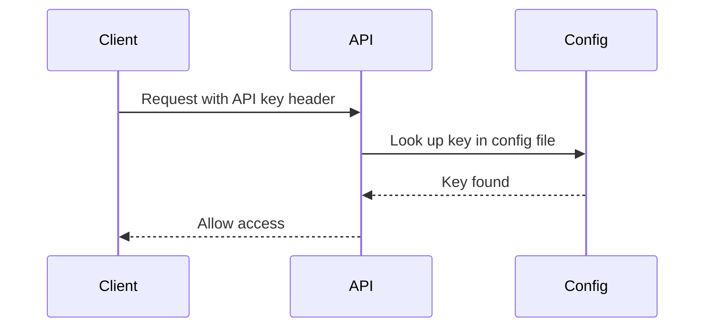
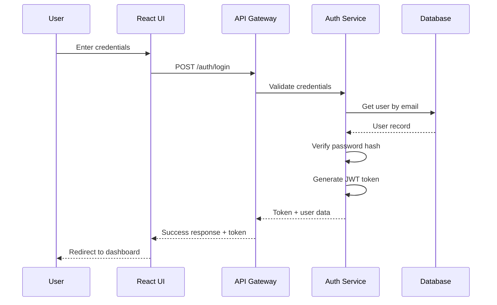
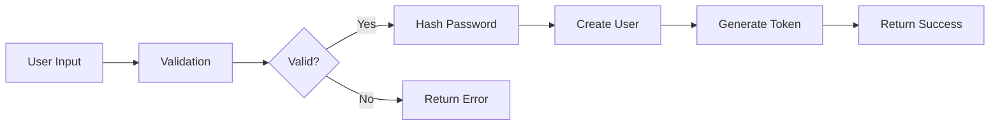

# SDD Design Documentation

Create technical design documents that explain HOW to implement the spec.

## When to Write Design Docs

Write design.md when ANY of these apply:

- Cross-cutting change (multiple services/modules)
- New external dependency or integration
- Significant data model changes
- Security implications
- Performance considerations
- Migration complexity
- Ambiguity needing upfront decisions

For simple changes, minimal design is fine.

## Design Document Structure

```markdown
# Design: <spec-name>

## Problem Statement
## Context
## Goals / Non-Goals
## Existing Solution (if modification)
## Architecture
## Decisions
## Components
## Data Models
## API Changes
## Testability, Monitoring & Alerting
## Risks / Trade-offs
## Migration Plan
## Open Questions
```

## Section Details

### Problem Statement

Clear, non-technical description of the challenge:

```markdown
## Problem Statement

<What problem are we solving? Describe in plain language.>
<Why does this matter to users/business?>
<What happens if we don't solve it?>

**Example:**
Users currently cannot log into our application. This prevents them from 
accessing personalized features and forces them to use the application as 
guests. Without authentication, we cannot offer saved preferences, order 
history, or account-specific features. Implementing user authentication 
will enable personalized experiences and increase user engagement.
```

## Section Details

### Context

Background information needed to understand the design:

```markdown
## Context

**Current State:**
<How things work now>

**Problem:**
<Why we need to change>

**Constraints:**
- Technical: <language, framework, infrastructure>
- Business: <deadlines, resources>
- External: <APIs, compliance requirements>

**Stakeholders:**
<Who cares about this change>
```

### Goals / Non-Goals

Explicitly define scope:

```markdown
## Goals / Non-Goals

### Goals
- <What this design achieves>
- <Specific outcomes>

### Non-Goals
- <Explicitly excluded>
- <Future considerations>
```

**Example:**
```markdown
### Goals
- Implement user authentication with email/password
- Support session management
- Enable password reset flow

### Non-Goals
- OAuth integration (future phase)
- Two-factor authentication
- Single sign-on (SSO)
```

### Existing Solution (if modification)

When modifying existing capabilities, document current state:

```markdown
## Existing Solution

**Current Implementation:**
- Users authenticate via API keys stored in config files
- API keys are manually distributed by admins
- No expiration or rotation mechanism

**How It Works:**


**Limitations:**
- API keys never expire (security risk)
- Manual key distribution is error-prone
- No audit trail of key usage
- Difficult to revoke compromised keys

**User Flow (Current):**
1. User requests API access from admin
2. Admin generates key manually
3. Admin sends key via email (insecure)
4. User adds key to their application config
5. Key works indefinitely

**Why Change:**
Moving to email/password auth with JWT tokens provides:
- Better security with expiring tokens
- Self-service account management
- Audit trail of authentication events
- Easier key rotation and revocation
```

### Architecture

High-level system design:

```markdown
## Architecture

<High-level overview of the solution>

### System Design

```mermaid
graph TB
    subgraph "Client Layer"
        UI[React UI]
    end
    
    subgraph "API Layer"
        Gateway[API Gateway]
        Auth[Auth Service]
        User[User Service]
    end
    
    subgraph "Data Layer"
        DB[(PostgreSQL)]
        Cache[(Redis)]
    end
    
    UI --> Gateway
    Gateway --> Auth
    Gateway --> User
    Auth --> Cache
    User --> DB
```



### Component Flow



### Data Flow



### Key Components
- **Auth Service**: Handles authentication logic
- **Token Service**: Generates and validates JWT tokens
- **User Repository**: Database operations for users
```

**Diagram Best Practices:**
- Use Mermaid diagrams (render natively in GitHub/GitLab/VS Code)
- Keep diagrams simple and readable
- Use subgraphs to group related components
- Label all connections with descriptions
- Show error paths when relevant

### Decisions

Document key technical choices:

```markdown
## Decisions

### Decision: Session Storage

**Context:** Need to store user sessions across requests

**Options Considered:**
1. **In-memory** - Pros: Fast / Cons: Lost on restart, doesn't scale
2. **Redis** - Pros: Fast, persistent, scalable / Cons: Additional infrastructure
3. **Database** - Pros: Simple, no new infrastructure / Cons: Slower

**Decision:** Redis

**Rationale:** 
- Need persistence across restarts
- Expect high session volume
- Already have Redis for caching
```

**Decision Template:**
```markdown
### Decision: <title>

**Context:** <situation requiring decision>
**Options Considered:**
1. <Option 1> - Pros: <benefits> / Cons: <drawbacks>
2. <Option 2> - Pros: <benefits> / Cons: <drawbacks>
**Decision:** <chosen option>
**Rationale:** <why selected>
```

### Components

Detail key components:

```markdown
## Components

### AuthService
**Responsibility:** Handle authentication logic
**Interface:** `authenticate(credentials) -> token`
**Dependencies:** UserRepository, TokenService

### TokenService
**Responsibility:** Generate and validate tokens
**Interface:** 
- `generate(userId) -> token`
- `validate(token) -> userId | null`
```

### Data Models

Schema changes and new models:

```markdown
## Data Models

### User (modified)
```typescript
interface User {
  id: string;
  email: string;          // new
  passwordHash: string;   // new
  createdAt: Date;
}
```

### Session (new)
```typescript
interface Session {
  id: string;
  userId: string;
  token: string;
  expiresAt: Date;
  createdAt: Date;
}
```

**Migration:** Add email, passwordHash columns with null constraint
```

### API Changes

Document API modifications:

```markdown
## API Changes

### POST /auth/login (new)
**Request:**
```json
{
  "email": "user@example.com",
  "password": "secret"
}
```

**Response (200):**
```json
{
  "token": "jwt-token",
  "expiresIn": 3600
}
```

**Errors:**
- 401: Invalid credentials
- 400: Missing fields
```

### Testability, Monitoring & Alerting

Document testing strategy and observability:

```markdown
## Testability, Monitoring & Alerting

### Testing Strategy

**Unit Tests:**
- Test password hashing utility
- Test token generation/validation
- Test authentication middleware
- Mock database calls

**Integration Tests:**
- Test login flow end-to-end
- Test token refresh flow
- Test logout functionality
- Test error scenarios

**End-to-End Tests:**
- Test complete user journey
- Test session persistence
- Test concurrent sessions

### Scenario Test Mapping

Map each EARS scenario to its test type and location:

| Requirement | Scenario | Test Type | Test File |
|-------------|----------|-----------|-----------|
| AUTH-001 | successful-login | Integration | tests/auth/login.test.ts |
| AUTH-001 | invalid-password | Unit | tests/auth/login.test.ts |
| AUTH-001 | account-locked | Unit | tests/auth/login.test.ts |
| AUTH-002 | token-generated | Unit | tests/auth/token.test.ts |
| AUTH-002 | token-expired | Unit | tests/auth/token.test.ts |

**Guidelines:**
- Every `WHEN/THEN` scenario maps to at least one test
- Error scenarios (`IF <error>`) have dedicated test cases
- Edge cases (boundaries, empty inputs, limits) have dedicated test cases
- Multi-component flows require integration tests
- Test file paths follow project conventions (detect from existing tests)

### Monitoring

**Metrics to Track:**
- Login success/failure rate
- Token generation count
- Authentication latency
- Active sessions count
- Password reset requests

**Logging:**
- Log all authentication attempts (without passwords)
- Log token refresh events
- Log suspicious activity patterns
- Use structured logging (JSON)

### Alerting

**Alert Conditions:**
- Spike in failed login attempts (>10/minute per IP)
- Authentication service down
- Token validation errors spike
- Database connection failures

**Runbooks:**
- Link to authentication troubleshooting guide
- Document common error codes
- Escalation procedures
```

### Risks / Trade-offs

Identify and mitigate risks:

```markdown
## Risks / Trade-offs

| Risk | Impact | Probability | Mitigation |
|------|--------|-------------|------------|
| Password database leak | High | Low | Bcrypt hashing, encryption at rest |
| Session token theft | High | Medium | Short expiry, HTTPS only, refresh tokens |
| Brute force attacks | Medium | High | Rate limiting, account lockout |
```

### Migration Plan

Steps to deploy:

```markdown
## Migration Plan

### Phase 1: Add Schema (week 1)
1. Add email, passwordHash columns (nullable)
2. Deploy backward compatible

### Phase 2: Migrate Users (week 2)
1. Add login UI
2. Send password setup emails
3. Users set passwords

### Phase 3: Enforce Auth (week 3)
1. Require authentication for protected routes
2. Remove legacy auth

### Rollback Plan
1. Revert to legacy auth
2. Keep password data for retry
```

### Open Questions

Track unresolved decisions:

```markdown
## Open Questions

- [ ] Should we support email change?
- [ ] What's the password reset email copy?
- [ ] Session timeout duration?

**Resolution needed by:** <date or milestone>
```

## Design Review Checklist

- [ ] All requirements addressed
- [ ] Key decisions documented with rationale
- [ ] Alternatives considered
- [ ] Risks identified and mitigated
- [ ] Migration plan complete
- [ ] Open questions tracked
- [ ] Diagrams where helpful
- [ ] Consistent with existing architecture

## Best Practices

### Keep It Focused
- Design for current requirements
- Don't over-engineer for hypothetical future
- But leave hooks for likely extensions

### Be Explicit
- State assumptions clearly
- Document why, not just what
- Include alternatives considered

### Make It Reviewable
- Use clear structure
- Include diagrams
- Write for future maintainers

### Stay Current
- Update design as you learn
- Document deviations
- Mark decisions as superseded
