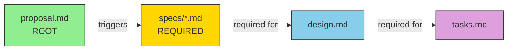

# SDD Spec Artefact

Create the next artifact in the spec development process.

## Dependency Graph



**Sequential Rule:** Each artifact MUST be created in order. No skipping.
- Specs MUST exist before design can be created
- Both specs AND design MUST exist before tasks can be created

## State Detection

Check filesystem for artifact status:

| Status | Condition | Output Message |
|--------|-----------|----------------|
| **DONE** | File exists AND has substantive content | - |
| **READY** | All dependencies are DONE | - |
| **BLOCKED** | Missing one or more dependencies | **BLOCKED: Create [artifact] first** |
| **PENDING** | Placeholder exists, no content | - |

### Artifact Dependencies & BLOCKED Messages

| Artifact | Status | Condition | BLOCKED Message |
|----------|--------|-----------|-----------------|
| proposal.md | DONE | exists with content | - |
| proposal.md | READY | - | "Create proposal first: /sdd-propose <name>" |
| specs/ | DONE | ≥1 spec file exists | - |
| specs/ | READY | proposal.md is DONE | - |
| specs/ | BLOCKED | proposal.md missing | **BLOCKED: Create proposal first** |
| design.md | BLOCKED | no specs/*.md exist | **BLOCKED: Create specs first (required)** |
| design.md | READY | specs/ has ≥1 file | - |
| tasks.md | BLOCKED | specs/ missing | **BLOCKED: Create specs first** |
| tasks.md | BLOCKED | design.md missing | **BLOCKED: Create design first** |
| tasks.md | READY | specs/ AND design.md exist | - |

## Guardrails

**CRITICAL - Follow these strictly:**

1. Create ONE artifact per invocation
2. Always read dependency artifacts before creating new ones
3. Never skip artifacts or create out of order
4. If context is unclear, ask the user before creating
5. Verify the artifact file exists after writing
6. `context` and `rules` are constraints for YOU, not content for the file

## Process

### Step 1: Detect Current State

Scan `.specs/changes/` for all active changes. If multiple found, ask user which one to continue.

For the selected change, check each artifact in **strict order**:

```
proposal.md  → DONE (exists with content)
specs/       → READY (proposal is done)
             → BLOCKED (proposal missing) → "BLOCKED: Create proposal first"
design.md    → BLOCKED (no specs exist) → "BLOCKED: Create specs first (required)"
             → READY (specs DONE)
tasks.md     → BLOCKED (needs specs AND design)
             → READY (specs AND design DONE)
```

### Step 2: Select Next Artifact

**STRICT SEQUENTIAL ORDER - No Parallel Creation:**

1. **specs** - MUST complete before design (BLOCKED until proposal exists)
2. **design** - BLOCKED until specs DONE (reads specs/**/*.md as REQUIRED input)
3. **tasks** - only after specs AND design are done

**Enforcement:**
- Never offer to create design if specs/ directory is empty
- Never offer to create tasks if specs/ or design.md missing
- If user requests out-of-order, output BLOCKED message and suggest correct next step

If all DONE, inform user and suggest `/sdd:apply`.

### Step 3: Read Dependencies

Before creating, read all dependency artifacts:

**For specs:**
- Read `proposal.md` for capabilities list and scope
- If modifying existing capability, read `.specs/specs/<module>/<capability>/spec.md`

**For design:**
- Read `proposal.md` for context and scope
- **REQUIRED:** Read `specs/**/*.md` for all requirements to address
- Verify every requirement ID is covered in design decisions/components

**For tasks:**
- Read `proposal.md` for scope
- Read `specs/**/*.md` for requirements to implement
- Read `design.md` for technical approach

#### Design Coverage Verification

After creating design.md, verify:
- [ ] All specs/*.md requirements have design coverage
- [ ] Each requirement ID appears in design decisions or components
- [ ] No orphaned requirements (in specs but not addressed in design)
- [ ] Edge cases from specs are handled in design

If gaps found: **BLOCKED** - Update design or specs before proceeding to tasks.

### Step 4: Create Artifact

#### Creating specs (Requirements)

For each capability in proposal, create `.specs/changes/<name>/specs/<capability>/spec.md`:

**For NEW capabilities:**

```markdown
# Specification: <capability-name>

## ADDED Requirements

### Requirement: <requirement-name>
The system SHALL <specific behavior>.

#### Scenario: <scenario-name>
- **WHEN** <condition>
- **THEN** <expected system behavior>

#### Scenario: <another-scenario>
- **WHEN** <event>
- **AND** <condition>
- **THEN** <expected behavior>
```

**For MODIFIED capabilities (delta specs):**

```markdown
# Specification: <capability-name>

> Existing spec: specs/<module>/<capability>/spec.md
> This is a DELTA spec showing changes from existing.

## MODIFIED Requirements

### Requirement: <requirement-name>
<Full updated requirement content including all scenarios>

#### Scenario: <scenario-name>
- **WHEN** <condition>
- **THEN** <outcome>

## ADDED Requirements

### Requirement: <new-requirement>
The system SHALL <behavior>.

#### Scenario: <scenario-name>
- **WHEN** <condition>
- **THEN** <outcome>

## REMOVED Requirements

### Requirement: <deprecated-requirement>
**Reason**: <why removed>
**Migration**: <how to migrate>
```

**EARS Format Requirements:**
- Use SHALL or MUST for normative requirements
- Each requirement MUST have at least one scenario
- Scenarios use WHEN/THEN format
- Cover normal, edge, and error cases

#### Creating design

**Requires:** `specs/*.md` MUST exist (BLOCKED otherwise)
**Require skill:** `sdd-design`
**Agent:** `sdd-design`

Create `.specs/changes/<name>/design.md` via the design agent.

**MANDATORY refinement process (cannot be skipped):**
1. Write initial design draft to disk
2. Run `sdd-design-analyst` review iterations 1..5
3. Save each critique report:
   - `review-iteration-1.md`
   - `review-iteration-2.md`
   - `review-iteration-3.md`
   - `review-iteration-4.md`
   - `review-iteration-5.md`
4. Revise design.md after each iteration
5. Continue through all 5 iterations even if early approval occurs
6. Final gate (iteration 5): `APPROVE`, `0 critical`, `0 major unresolved`, `100% requirement coverage`
7. MIN-* findings SHOULD be fixed during refinement; unresolved MIN-* findings MUST be documented with rationale and follow-up
8. Any MIN-* affecting security/compliance/data integrity/requirement coverage MUST be reclassified to MAJOR or CRITICAL

**Prerequisites Check:**
- If `specs/` directory is empty: **BLOCKED** - Output "BLOCKED: Create specs first (required)"
- Design agent MUST verify all requirements from specs are addressed
- Design is BLOCKED until all five review reports exist

#### Creating tasks

**Require skill:** `sdd-tasks`
Create `.specs/changes/<name>/tasks.md`:

```markdown
# Tasks: <spec-name>

## 1. Setup

- [ ] 1.1 <setup task>
  - _Requirements: <requirement-ref>_

## 2. Core Implementation

- [ ] 2.1 <implementation task>
  - _Requirements: <requirement-ref>_
- [ ] 2.2 <implementation task>
  - _Requirements: <requirement-ref>_

## 3. Testing

- [ ] 3.1 <testing task>
  - _Requirements: <requirement-ref>_

## 4. Documentation & Cleanup

- [ ] 4.1 <documentation task>
```

**Task Guidelines:**
- Each task MUST be a checkbox: `- [ ] X.Y Task description`
- Tasks should complete in one session (2-4 hours)
- Order by dependency (what must be done first?)
- Reference specific requirements for traceability

### Step 5: Update Proposal Status

Update the Status section in `proposal.md`:

```markdown
## Status
- [x] Requirements: done
- [ ] Design: pending
- [ ] Tasks: pending
```

### Step 6: Report Progress

```
✓ Created: specs/<capability>/spec.md
✓ Updated proposal status

Artifact Status:
  proposal: DONE
  specs: DONE
  design: READY
  tasks: BLOCKED (waiting for design)

Next: Use /sdd-artefact to create design
```

## Quality Checklists

### Requirements Checklist
- [ ] All user roles identified
- [ ] Normal cases covered
- [ ] Edge cases covered
- [ ] Error cases covered
- [ ] Each requirement is testable
- [ ] EARS format used consistently

### Design Checklist
- [ ] All requirements addressed
- [ ] Key decisions documented
- [ ] Alternatives considered
- [ ] Risks identified

### Tasks Checklist
- [ ] All design elements have tasks
- [ ] Tasks properly sequenced
- [ ] Each task is actionable
- [ ] Requirement references included

**Loads skill:** `sdd-design`
